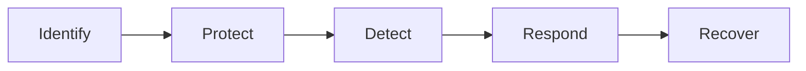

## Security Frameworks

Security frameworks are documented processes that define policies and procedures organisations should follow to establish and manage security controls. They are blueprints for identifying and managing the risks they may face and the weaknesses in place that may lead to an attack.

## NIST Cybersecurity Framework
The Cybersecurity Framwork (CSF) was developed by the National Institute of Standards and Technology (NIST) to provide detailed guidance for organisations to manage and reduce cybersecurity risk. 



## ISO 27000 Series
ISO develops a series of frameworks for different industries and sectors. The ISO 27001 and 27002 standards are commonly known for cybersecurity and outline the requirements and procedures for creating, implementing and managing an information security management system (ISMS). These standards can be used to assess an institution’s ability to meet set information security requirements through the application of risk management.


## Grep

use grep to search for a string in a file

```bash
grep "string" file
grep -i "string" file # case insensitive
grep -v "string" file # invert match
grep -r "string" file # recursive
grep -E "string" file # extended regex
man grep
```

#### Examples of what you could look for: 
1. A name of a computer.
2. A name of a file.
3. A name of a user account.
4. An IP address.
5. A certain timestamp or date.

## NMAP

TCP SYN Scan: Get the list of live hosts and associated ports on the hosts without completing the TCP three-way handshake and making the scan a little stealthier. 
Usage: 
```bash 
nmap -sS MACHINE_IP
```
Ping Scan: Allows scanning the live hosts in the network without going deeper and checking for ports services etc. 
```bash 
nmap -sn MACHINE_IP
```
Operating System Scan: Allows scanning of the type of OS running on a live host. 
```bash 
Usage: nmap -O MACHINE_IP
```
Detecting Services: Get a list of running services on a live host. 
```bash 
nmap -sV MACHINE_IP
```


## Nikto
Nikto is open-source software that allows scanning websites for vulnerabilities. It enables looking for subdomains, outdated servers, debug messages etc., on a website. You can access it on the AttackBox by typing
```bash
nikto -host 10.10.149.202
```

## Hydra

```bash
1. hydra -l username -P wordlist.txt server service
2. hydra -l mark -P /usr/share/wordlists/rockyou.txt 10.10.199.157 ssh
3. hydra -l mark -P /usr/share/wordlists/rockyou.txt ssh://10.10.199.157
```
1. -l username: -l should precede the username, i.e. the login name of the target. You should omit this option if the service does not use a username.
2. -P wordlist.txt: -P precedes the wordlist.txt file, which contains the list of passwords you want to try with the provided username.
3. server is the hostname or IP address of the target server.
4. service indicates the service in which you are trying to launch the dictionary attack.

(Wordlists) mark as the username as it iterates over the provided passwords against the SSH server.

-V or -vV, for verbose, makes Hydra show the username and password combinations being tried. This verbosity is very convenient to see the progress, especially if you still need to be more confident in your command-line syntax.

-d, for debugging, provides more detailed information about what’s happening. The debugging output can save you much frustration; for instance, if Hydra tries to connect to a closed port and timing out, -d will reveal this immediately.