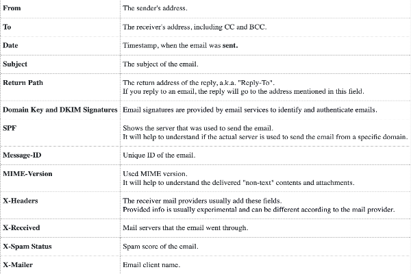
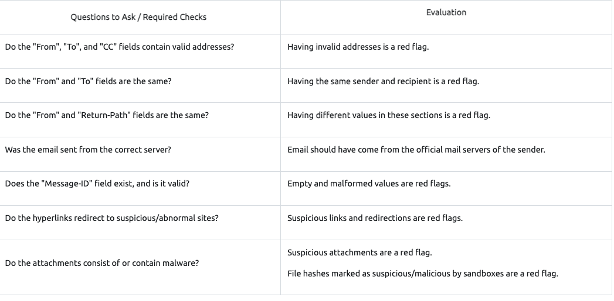
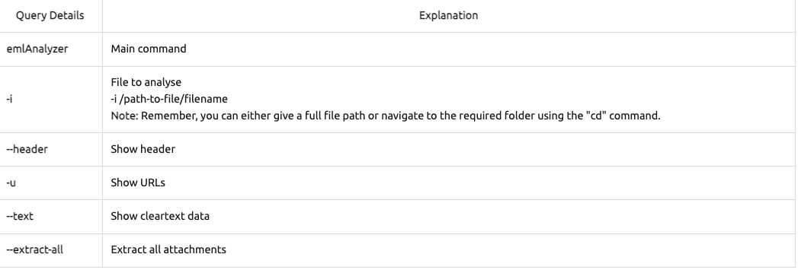

## Email Analysis

the process of extracting the email header information to expose the email file details. The email header contains the technical details of the email like


- Security issues: Identifying suspicious/abnormal/malicious patterns in emails.
- Performance issues: Identifying delivery and delay issues in emails.
-----------------------
- Social engineering: [[club-eh.SocialEngineering]]
    - Phishing: Phishing is a sub-section of social engineering delivered through email to trick someone into either revealing personal information and credentials or executing malicious code on their computer.

### Why does it matter
Phishing attacks are still extremely common, effective and difficult to detect. It is also part of penetration testing and red teaming implementations (paid security assessments that examine organisational cybersecurity).




-----------------------

### Email Header Analysis
Text editors are helpful in analysis, but there are some tools that can help you to view the email details in a clearer format.

tool: https://emailrep.io/


#### emlAnalyzer
"emlAnalyzer" is a tool to view the body of the email and analyse the attachments. The emlAnalyzer is a tool designed to parse email headers for a better view and analysis process. The tool is ready to use in the given VM. The tool can show the headers, body, embedded URLs, plaintext and HTML data, and attachments. The sample usage query is explained below.



```bash
 emlAnalyzer -i Urgent\:.eml --header --html -u --text --extract-all
 ```

### Tool + Purpose

gets websites url for all

VirusTotal:  [[https://www.virustotal.com/gui/home/upload]]
- ##### sha256sum tool/utility to calculate the file's hash value. 
-       A service that provides a cloud-based detection toolset and sandbox environment.
InQuest: [[https://labs.inquest.net/]]
-       A service provides network and file analysis by using threat analytics.
IPinfo.io [[https://ipinfo.io/]]
-        A service that provides detailed information about an IP address by focusing on geolocation data and service provider.
Talos Reputation [[https://talosintelligence.com/reputation_center/lookup]]
-        An IP reputation check service is provided by Cisco Talos.
Urlscan.io [[https://urlscan.io/]]
-        A service that analyses websites by simulating regular user behaviour.
Browserling [[https://www.browserling.com/]]
-        A browser sandbox is used to test suspicious/malicious links.
Wannabrowser [[https://wannabrowser.com/]]
-        A browser sandbox is used to test suspicious/malicious links.