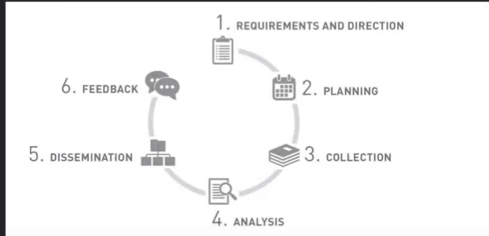

Gathering information from public sources
~
Text, Images, Videos, Audio, Books, Reports, etc

OSINT is goal oriented, you are looking for something specific.

OSINT is the process to create a profile of the target. Finding out everything you can about the target through the web. 

> 1. Determine Requirements ~ Direction of intellignece gathering, Required tools
> 2. Planning ~ What, Where, Who, When, How, Why
> 3. Collect Information ~ Execute the plan
> 4. Analyse Information ~ What did you find, what is relevant, what is not relevant

{width: 75%}

## OSINT techniques
#### Passive ~ not interacting with the target
- Internet Search 
- Source Identification
- Image data [ EXIF ]
- Data leaks
- WHOIS

#### Active
- Sock puppets - Throwaway accounts that are used to interact with the target
- NMAP - Port scanning 
- Social Engineering - Phishing, Spear Phishing, Vishing, Smishing, etc

> [All attainable information through OSINT](https://osintframework.com/)
~ Super useful website, has a lot of information on how to gather information through OSINT

## Google

> - Domain registered in 1997
- Biggest and most popular search engine in the world

- WebCrawler
    - A program that systematically browses the internet and indexes servivces 

## Google Dorks
- Search strings using advanced operators
- OSINT deals with information that anyone on the Internet can find, it often uncovers information that most people do not know is public ~ *Google indexes a lot.*    

#### operators
        - filetype:[filetypename] ~ Searches for a specific file type
        - site:[domainname] ~ Searches for a specific domain
        - intitle:[text] ~ Searches for a specific text in the title
        - inurl:[text] ~ Searches for a specific text in the url
        - intext:[text] ~ Searches for a specific text in the body of the page
        - allintext:[text] ~ Searches for a specific text in the body of the page

#### examples
        - filetype:pdf intext:passwords
        - site:hackthebox.eu intext:flag
        - site:github.com intitle:awesome
        - site:reddit.com inurl:flag allintext:flag
        - site:pastebin.com "@gmail.com password"
        - intitle:"WEBCAM 7" -inurl:/admin.html
        - site:insecam.org
        - intitle: index of .exe
        - intitle: index of .mp3

## Google Dorks Cheatsheet
[[/assets/google.pdf]]