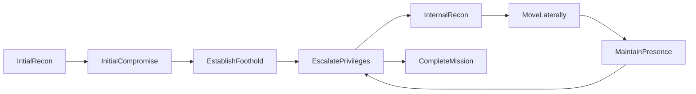
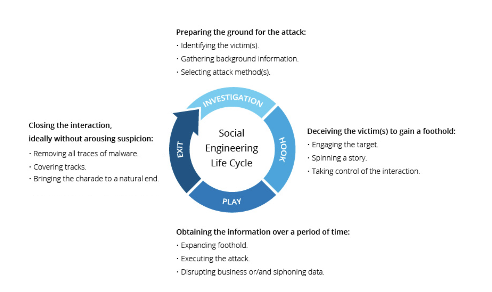

## What is Social Engineering
- In information security it is: Psychological manipulation of people into performing actions or divulging confidential information
    - It is usually never in the victims interest to follow instructions

### Attack Cycle

## How does Social Engineering usually occur? 
Normally you would say that spam emails and texts are so obvious that no one would fall for them, but they do. Social Engineering only has to work once to be successful. As soon as you let your guard down, you are vulnerable.
> - Scam calls
    - Usually impersonating an authority figure or a familiar individual
- Spoofed Emails
    - Same kind of impersonations as before byt can get more specific with spear-phishing attacks
- Spoofed Texts
    - Involves attempting to compromise your mobile device

{width: 75%}

### Phishing Vs Spear Phishing
It is just the foothold, the initial compromise. The door is open. It is the first step in the attack cycle.
> - Phishing
    - A general attack that targets a large group of people. The targets of phishing attacks are everyone but there are also populations that are more vulnerable such as: Elderly and Disabled. Impersonating often holders of public offices. Executives, info@, payments@, accounting@ etc. 
- Spear Phishing
    - A targeted attack that targets a specific individual or group. Spear phishing is a more targeted attack that uses social engineering to trick a specific person into giving up sensitive information. Spear phishing is more effective than traditional phishing because it is more targeted and personal. Spear phishing is also more difficult to detect because it is more difficult to identify the source of the attack.
- Whale Phishing
    - A targeted attack that targets a high level executives.

Your data (email, name, phone number, address) is obtained from advertings list that are put together by websites that you sign up for selling your data to third party advertisers stated hidden within their terms of service. 

### Malicious Files
- Word or Excel documents
    - Macros
- PDFs
- Pictures 
- Homograph attacks
    - Using a similar looking domain name to the real one
- Links 
    - Redirects to a malicious website
    - Redirects to a malicious file

### Mitigation
- Verify links before clicking 
- Do not send sensitive information through email or text
- Apply software updates and patches
- Filter spam emails
- Education and awareness! 

#### Trusted sec social engineering tool kit : Kali VBox
Very useful tool for social engineering