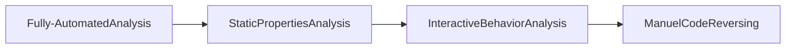

### Difficulty:

is it malware?
How bad is it?
How to detect it?

## Initial Analysis

### Static Properties Analysis ~ 
Involved in the analysis of the malware's static properties, such as the file format, file size, and file type. Metadata. 
- Hashes
- Strings 
- File format
- imports and exports - VirtualAlloc
- Packer Identification
- Malware data repository - VirusTotal
- IOC - Indicators of Compromise

### Interactive Behavior Analysis ~
- Execute malware in an silated Windows lab system.
- Observe how it interacts with the file system, registry and network.
- Interact with the malware to learn more about it.

#### Good practice
1. Build your own VM from scratch
2. Download a free VM from Microsoft: bit.ly/windowsvm
3. Add tools by hand or with FLARE VM: flarevm.info

REMnux is a free Linux distro with lots of rpeinstalled malware analysis tools: remnux.org

#### Mitigate the risks of malware escaping from your lab 

1. Avoid production network connectivity
2. Decicate a physical host to the lab
3. Restore the host if anything suspicious occurs.
4. Keep up eith patches to the VM software and the host OS.

#### Launch monitoring tools in the lav then run the malware

- Process Hacker: Observes running processes and their threads - Can extract strings from memory of the suspicious process - shows handles, including mutex names, which can be IOCs and an infection markers   

- Process Monitor: Observes local file interactions
- ProcDOT: Cleans up and visualizes Process Monitor data 
- Wireshark: Observes network traffic

