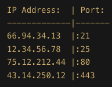

### What is a port
- It is a logical connection that's used by programs and services to exchange data/information.
- It specifically determines which program or service on a computer or server that is going to be used.
    - Ex: Web pages, FTP, Email, etc
    {float: right}
- Ports have a unique number that identifies them. ranges between 0-65535
    - 80, 443 - Web pages (http, https)
    - 21 - FTP (File transfer protocol)
    - 25 - SMTP (Simple Mail Transfer Protocol)
    
A port is always associated with an IP Address. An IP address is a numeric identifier for a device on a network. Every device needs an IP address to communicate with other devices on the network. An IP address and a port work together to exchange data on a network.

#### Typical server request
 - An IP address determines the geographical location of the server in order to access it
- A port determines which program or service on the server is going to be used
    > 1. Convert URL to IP Address | google.com -> 215.114.85.17
    2. Add Port to IP Address since we are using a webbrowser which is using http | 215.114.85.17 + :80
    3. IP address is used to locate particular server | Slap IP into GPS and find server
    4. Server takes port number to determine which program or service to use to retrieve the google webpage

### IANA (Internet Assigned Numbers Authority)
- IANA is responsible for the global coordination of the DNS Root, IP addressing, and other Internet protocol resources.
- Your computer can act as a server and listen for incoming connections on a specific port.
##### Server Ports
- Port numbers **0-1023** are System or Well-known ports - common ports are used everyday
- Port numbers **1024-49151** are User or Registered ports - can be registered by companies or developers for a particular service. 
##### Client Ports
- Port numbers **49152-65535** are Dynamic or Private ports - client-side ports that are free to use, ports that your computer assigns temporarily to itself during a session.e.g. 49152, 49153, 49154, etc.


#### Netstat
- Network statistics
- Command line tool that is used to display the current network connections and port activity on a computer

FTP - File Transfer Protocol - Port Number: 21
- FTP is a standard network protocol used to transfer files from one computer to another over a TCP-based network, such as the Internet.
- ```mget *``` - download all files in the current directory
- ```mput *``` - upload all files in the current directory
- ```mdelete *``` - delete all files in the current directory


