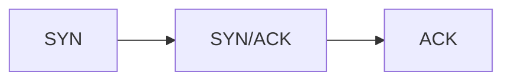

3 packets

### TTL - Time to live ~ 64/128/255 maaaybe 60

- 128 means that the has not been routed or the packet started at 255 and has been routed 127 times. (Most likey client side)
- Most TTLs are 64. 
- Random identifying TTL numbers are no longer used.
- (Exception) A box in the middle can mess with the IP header info and change the TTL.
- Anything less (127, 126) is a server side packet. Been routed 1 or 2 times. Can get around the world in 15 or less hops.
- Whenever a IP stack creates a IP header it always starts with a full TTL (whatever its number is)

### TCP Options

- MSS - Maximum Segment Size
    - Normally 1460 bytes
    - Can be knocked down by routers/firewalls while hopping 

- SACK - Selective Acknowledgement
    - Allows the receiver to acknowledge only the segments it has received
    - Allows the sender to retransmit only the missing segments
    - Can be used to detect packet loss
    - Can be used to detect out of order packets
    - Only said once in the handshake! Could look at the behavior of the TCP window to detect SACK
    
- ## TCP Windows
    - CWND and RWND
    - Only RWND is advertised in header
    - Metafor: the windows is a pipe and the TCP window is the size of the pipe. Data is sent through the pipe as water. The amount of water that can be sent through the pipe is decided by the size of the pipe
    ### Reality
    - The network has limtations - Packet loss, buffers, Bandwidth, Congestion, Latecy, etc
    - The client has limitations : bucket delivering water through pipe : - Resource load, TCP RX window, Application interaction with TCP, etc
    - The server has limitations - or intentionally limits itself due to network conditions - Low CWND, Congested Resources, Low Resources, etc | App takes the data from the TCP RX window and put it into the application layer. 
    - Example: While transfering data, small packet delays can add up over time. The app layer was not  Death by a thousand cuts. 
    
- RWND
    - 

- ### Congestion Window
    - How much can this server actaully send
    - Unlike the RWND it is not advertised in the header
    - A sender-side limit on the amount of data the sender can transmit before rx an ACK
    - The smaller of the two (RWND or CWND) governs the data transimission
        - CWND = x * MSS
        - Initial size varies - 1, 2, 4...
        - Can double every RTT
    - The server should not be sending so much that it hits its head on the bandwidth ceiling
    - Slow start - Congestion avoidance 
    
- Window Scaling
    - Allows the sender to increase the size of the TCP window
    - Window scale factor log base 2
    - Only said once in the handshake!

- Sequence numbers 
    - Ghost bit (0) is sent in the first SYN packet from client to establish a base sequence number and ack number
    - Server incremetes ack number by 1, returns both ack and seq (still ghost bit 0) numbers
    - Client increments seq number in ACK packet by 1
    - seq and ack numbers are now in sync and are "1" for the first data exchange
    - seq number increases is (starting seq number + data sent in bytes)

